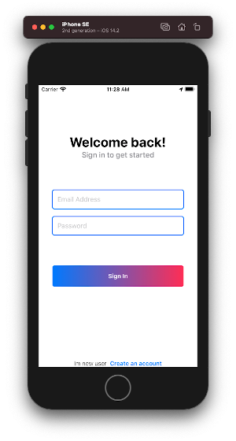
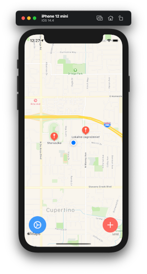
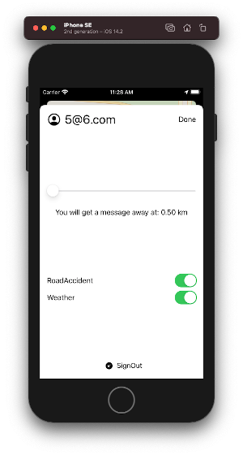

#  Inzynierka Grzegorz Gumieniak 

## O aplikacji
Aplikacja pozwala na zgłaszanie i otrzymywanie powiadomień o lokalnych zagrożeniach. 
Do stworzenia aplikacji wykorzystano:
* Swift
* SwiftUI
* Firebase
* Cocoapods (do instalacji Firebase)

## Wygląd aplikacji:

## Wymagania
* iOS 13.0+ 
* Swift 5
## Jak uruchomic
* `git clone https://github.com/ggumieniak/ProjectXKG.git && cd ProjectXKG`
* Po pobraniu  prosze uruchomic plik __ProjectXKG.xcworkspace__  
## Przydatne
* Link do formatowania MD =  [Tutaj](https://github.com/adam-p/markdown-here/wiki/Markdown-Cheatsheet)
* master - dzialajaca aktualnie aplikacja, kompiluje sie i posiada podstawowa sprawnosc
* dev - aktualne poprawki, które robie. Moze zawierac bledy lub nie kompilowac sie
## Co robię aktualnie
* __Testy__ 
## Do zrobienia:
* Dodanie wychwycenie bledow podczas parsowania danych z firebase
* Po nacisnieciu pineski wyswietlenie informacji kto zglosil i co zglosil (szczegoly)
* Wykorzystanie CoreData zamiast singleton'a 
## Przydaloby sie:
* _Przetworzyc rejestracje, aby uzytkownicy mogli personalizowac swoj nickname_
* Wieksza ilosc danych o uzytkowniku i personalizacja
* Dodanie zdjęcia z wydarzenia
## Zrobione
* Zdarzenia:
    * __Kategorie__ - mozliwosc wyszukania (drogowa, gaz etc.)
    * Wyswietlic czas zdarzenia
* Zrobic menu ustawien: 
    * _Wybor kategorii_ 
* Powiadomienia push (notyfikacje) przy pobraniu nowych danych
* __Mozliwie wybor promienia w jakim chce dostawac powiadomienia__
* __Mozliwie wybor promienia w jakim chce dostawac powiadomienia__
* __Odswiezanie lokalizacji aktywnie podczas pobierania danych__
* Skrypt do usuwania starych wydarzeń w bazie (na serwerze, nie w aplikacji)
* Narysowanie na mapie gdzie jest jakis problem
* Wyświetlenie informacji w danym obszarze 
* Sprawdzic czy na urzadzeniu fizycznym bedzie ciagla zmiana lokalizacji
* Wyświetlenie informacji, gdzie obecnie się znajdujemy
* Dodanie mapy
* Przejscie do mapy, jezeli uzytkownik sie zarejetrowal
* Logowanie
* Rejestracja
* Stworzyc managera, ktory sledzi nasza lokalizacje
* Wyswietlic Tekst na mapie z koordynatami
* __Dodac obsluge bazy danych__
    * Udostepnic do bazy danych
* Przycisk do zgłaszania informacji:
    * Zgłasza informacje
        * Do konsoli
* Połączenie się z bazą danych
* Przesłanie lokalizacji do bazy danych
* Pobranie lokalizacji w bazie danych
* Wyświetlenie informacji z bazy danych
* Aktywna akutalizacja danych (czyli pobieranie danych z firebase w tle)
* Ograniczenie pobieranych danych w jakims wymiarze czasu (bo jesli byloby uzytkownikow tysiace, musialby przetwarzac tysiac inforamcji w sekunde)
* Konwersja czasu serwerowego na czas lokalny uzytkownika
* Dodanie konwersji danych z serwera na zgodna w aplikacji
* __Wyslac informacje do bazy danych__
## Uzytkownik do zalogowania
* __Login__: _1@2.com_
* __Haslo__: _123456_
* __Login__: _3@4.com_
* __Haslo__: _qwertyuiop_
